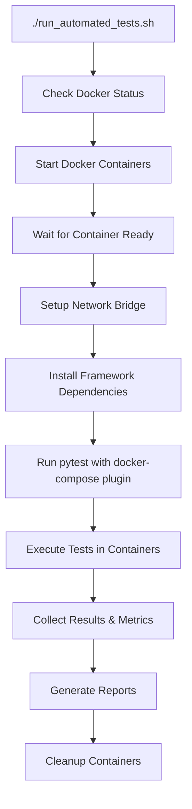

# 🔄 **Automatyczne łączenie testów frameworka Mancer**

## 🎯 **Jak testy łączą się automatycznie**

### **1. Start testów → Docker environment**

```bash
# Użytkownik uruchamia:
./run_automated_tests.sh

# System automatycznie:
1. Sprawdza czy Docker działa ✓
2. Uruchamia docker-compose.yml ✓  
3. Czeka aż kontenery są ready ✓
4. Ustanawia sieć między kontenerami ✓
5. Uruchamia pytest z Docker integration ✓
```

### **2. Przepływ automatycznego łączenia:**



---

## 🔍 **Co dokładnie sprawdzają testy**

### **A) Unit Tests - Sprawdzają logikę frameworka:**

```python
# ✅ Test 1: Czy CommandFactory tworzy komendy
def test_command_factory_creates_echo_command():
    factory = CommandFactory("bash")
    echo_cmd = factory.create_command("echo")
    assert echo_cmd is not None  # ← Framework ma komendę 'echo'
    assert hasattr(echo_cmd, 'text')  # ← Komenda ma metodę .text()
    
# ✅ Test 2: Czy BashBackend wykonuje bash
@patch('subprocess.run')
def test_bash_backend_executes_command(mock_run):
    mock_run.return_value.returncode = 0
    mock_run.return_value.stdout = "test output"
    
    backend = BashBackend() 
    result = backend.execute_command("echo test")
    
    assert result.success == True  # ← Framework obsługuje sukces
    assert "test output" in result.raw_output  # ← Framework przekazuje output

# ✅ Test 3: Czy ShellRunner łączy wszystko
def test_shell_runner_orchestration():
    runner = ShellRunner(backend_type="bash")
    echo_cmd = runner.create_command("echo").text("integration")
    
    assert runner.factory is not None  # ← Ma factory
    assert echo_cmd is not None  # ← Factory działa
    # Test execution w osobnym teście (integration)
```

### **B) Integration Tests - Sprawdzają framework + bash:**

```python
# ✅ Test 1: Framework + prawdziwy bash w kontenerze
def test_framework_bash_integration(container_ready):
    container_name = container_ready  # ← Automatic Docker connection
    
    # Framework execution w kontenerze przez docker exec
    test_script = '''
import sys
sys.path.append("/home/mancer1/mancer/src")
from mancer.application.shell_runner import ShellRunner

runner = ShellRunner(backend_type="bash")
echo_cmd = runner.create_command("echo").text("integration test")
result = runner.execute(echo_cmd)

print("RESULT_SUCCESS:", result.success)
print("RESULT_OUTPUT:", result.raw_output)
'''
    
    stdout, stderr, exit_code = execute_bash_command_in_container(
        container_name, f"python3 -c '{test_script}'"
    )
    
    # Sprawdzamy czy framework działa w kontenerze:
    assert "RESULT_SUCCESS: True" in stdout  # ← Framework execution OK
    assert "integration test" in stdout      # ← Bash output przeszedł przez framework

# ✅ Test 2: Czy wszystkie core komponenty działają razem
def test_core_framework_validation(container_ready):
    validation = validate_mancer_framework(container_ready)
    
    assert validation["python_available"] == True      # ← Python działa
    assert validation["mancer_importable"] == True     # ← Framework import OK
    assert validation["shell_runner_available"] == True # ← ShellRunner działa
    assert validation["bash_backend_working"] == True   # ← BashBackend + bash OK
    assert validation["command_factory_working"] == True # ← CommandFactory tworzy komendy
```

### **C) E2E Tests - Sprawdzają kompletny scenariusz:**

```python
# ✅ Test 1: Framework używany jak prawdziwa aplikacja
def test_end_to_end_framework_usage(container_ready):
    # Symuluje prawdziwe użycie frameworka
    e2e_script = '''
import sys
sys.path.append("/home/mancer1/mancer/src")
from mancer.application.shell_runner import ShellRunner

# Scenariusz: Administrator sprawdza system
runner = ShellRunner(backend_type="bash")

# 1. Sprawdź hostname
hostname_cmd = runner.create_command("hostname")
hostname_result = runner.execute(hostname_cmd)

# 2. Sprawdź dostępne miejsce
df_cmd = runner.create_command("df").human_readable()
df_result = runner.execute(df_cmd)

# 3. Sprawdź procesy
ps_cmd = runner.create_command("ps")
ps_result = runner.execute(ps_cmd)

# Wyniki
print("E2E_HOSTNAME_SUCCESS:", hostname_result.success)
print("E2E_DF_SUCCESS:", df_result.success) 
print("E2E_PS_SUCCESS:", ps_result.success)
print("E2E_ALL_SUCCESSFUL:", all([
    hostname_result.success, 
    df_result.success, 
    ps_result.success
]))
'''

    stdout, stderr, exit_code = execute_bash_command_in_container(
        container_name, f"python3 -c '{e2e_script}'"
    )
    
    # Sprawdzamy kompletny workflow:
    assert "E2E_HOSTNAME_SUCCESS: True" in stdout  # ← hostname command OK
    assert "E2E_DF_SUCCESS: True" in stdout        # ← df command OK  
    assert "E2E_PS_SUCCESS: True" in stdout        # ← ps command OK
    assert "E2E_ALL_SUCCESSFUL: True" in stdout    # ← Framework handle multiple commands

# ✅ Test 2: Framework w wielu kontenerach (networking)
def test_multi_container_framework_usage():
    # Test czy framework działa gdy kontenery się komunikują
    
    # Kontener 1: uruchamia framework
    # Kontener 2: jest target dla SSH
    
    result = test_framework_ssh_to_another_container(
        source_container="mancer-test-1",
        target_container="mancer-test-2"  
    )
    
    assert result["ssh_connection_ok"] == True      # ← SSH połączenie działa
    assert result["framework_remote_exec"] == True  # ← Framework przez SSH działa
    assert result["commands_executed"] > 0          # ← Wykonano komendy zdalnie
```

---

## 🤖 **Automatyczne procesy testów**

### **1. Fixture automation - Docker containers:**

```python
@pytest.fixture(scope="session")
def docker_setup():
    """Automatycznie uruchamia całe środowisko Docker"""
    print("🐳 Starting Docker test environment...")
    
    # Automatic Docker container startup
    subprocess.run([
        "docker-compose", "-f", "docker-compose.yml", 
        "up", "-d", "--build"
    ])
    
    # Automatic wait for containers ready
    containers = ["mancer-test-1", "mancer-test-2", "mancer-test-3"]
    for container in containers:
        wait_for_container_ready(container, timeout=60)
        print(f"✅ Container {container} ready")
    
    yield containers  # ← Tests run here
    
    # Automatic cleanup
    subprocess.run([
        "docker-compose", "-f", "docker-compose.yml", 
        "down", "--volumes"
    ])
    print("🧹 Docker environment cleaned up")

@pytest.fixture(scope="function")  
def container_ready(docker_setup):
    """Automatycznie dostarcza gotowy kontener do testów"""
    container_name = "mancer-test-1"
    
    # Automatic framework validation before each test
    validation = validate_mancer_framework(container_name)
    if not all(validation.values()):
        pytest.skip("Framework not ready in container")
    
    return container_name  # ← Test gets ready container automatically
```

### **2. Test execution automation:**

```python
# pytest.ini - automatyczna konfiguracja
[tool:pytest]
addopts = 
    --verbose
    --docker-compose=development/docker_test/docker-compose.yml
    --docker-compose-no-build  # Używa już zbudowanych containers
    --tb=short
    --maxfail=3  # Stop after 3 failures (fail fast)
    --durations=10  # Show 10 slowest tests
    
markers =
    unit: Unit tests (fast, mockowane)
    integration: Integration tests (framework + bash)  
    e2e: End-to-end tests (framework + Docker)
    slow: Slow tests (performance, stress)

# Automatic test discovery
testpaths = tests
python_files = test_*.py
python_classes = Test*
python_functions = test_*
```

### **3. CI/CD automation:**

```yaml
# .github/workflows/framework_tests.yml
name: Framework Tests
on:
  push:
    branches: [main, develop]
  pull_request:
    branches: [main]

jobs:
  unit-tests:
    runs-on: ubuntu-latest
    steps:
      - uses: actions/checkout@v3
      - name: Set up Python
        uses: actions/setup-python@v4
        with:
          python-version: '3.10'
      
      - name: Install dependencies
        run: |
          pip install -r requirements.txt
          pip install pytest pytest-cov
      
      - name: Run unit tests
        run: |
          pytest tests/unit/ -v --cov=src/mancer --cov-report=xml
      
      - name: Upload coverage
        uses: codecov/codecov-action@v3

  integration-tests:
    runs-on: ubuntu-latest
    needs: unit-tests
    steps:
      - uses: actions/checkout@v3
      
      - name: Set up Docker
        uses: docker/setup-buildx-action@v2
      
      - name: Run integration tests
        run: |
          cd development/docker_test
          ./run_automated_tests.sh --integration-only
      
      - name: Archive test results
        uses: actions/upload-artifact@v3
        with:
          name: integration-test-results
          path: logs/

  e2e-tests:
    runs-on: ubuntu-latest  
    needs: integration-tests
    if: github.event_name == 'push'  # Only on push, not PR
    steps:
      - uses: actions/checkout@v3
      
      - name: Run E2E tests
        run: |
          cd development/docker_test
          ./run_automated_tests.sh --e2e-only
          
      - name: Performance report
        run: |
          python3 tests/performance/generate_report.py
```

---

## 📊 **Co sprawdzają testy - szczegółowa mapa**

### **Unit Tests sprawdzają (mock/izolowane):**

| Komponent | Co testujemy | Przykład assertion |
|-----------|--------------|-------------------|
| **CommandFactory** | Tworzenie obiektów komend | `assert factory.create_command("ls") is not None` |
| | Rejestracja typów komend | `assert "echo" in factory._command_types` |
| | Handling nieznanych komend | `assert factory.create_command("xyz") is None` |
| **BashBackend** | Wywołanie subprocess.run | `mock_run.assert_called_with([...])` |
| | Parsing wyniku | `assert result.exit_code == mock.returncode` |
| | Error handling | `assert result.success == False` when error |
| **ShellRunner** | Orchestracja komponentów | `assert runner.factory is not None` |
| | Cache management | `assert runner._cache_enabled == True` |
| | Context handling | `assert runner._context.current_directory == "/tmp"` |

### **Integration Tests sprawdzają (framework + bash):**

| Scenariusz | Co testujemy | Przykład assertion |
|------------|--------------|-------------------|
| **Framework execution** | Prawdziwe bash execution | `assert "test output" in result.raw_output` |
| | Exit codes | `assert result.exit_code == 0` |
| | Error propagation | `assert result.success == False` when bash fails |
| **Command building** | Czy framework buduje poprawny bash | `assert "echo hello" == cmd.build_command()` |
| | Parameter handling | `assert "ls -la" == ls_cmd.long().all().build_command()` |
| **Framework components** | Czy wszystko działa razem | `assert validation["all_components"] == True` |

### **E2E Tests sprawdzają (framework + Docker + environment):**

| Scenariusz | Co testujemy | Przykład assertion |
|------------|--------------|-------------------|
| **Container deployment** | Framework w izolowanym środowisku | `assert framework_works_in_container == True` |
| **Network communication** | SSH między kontenerami | `assert ssh_connection_successful == True` |
| **Performance** | Framework overhead | `assert execution_time < 0.1  # seconds` |
| **Resource usage** | Memory, CPU usage | `assert memory_usage < 100  # MB` |
| **Real workflows** | Prawdziwe scenariusze użycia | `assert admin_workflow_completed == True` |

---

## 🔧 **Praktyczne uruchomienie automatycznych testów**

### **Sposób 1: Wszystkie testy automatycznie**
```bash
cd development/docker_test
./run_automated_tests.sh

# Co się dzieje automatycznie:
# 1. ✅ Check Docker daemon
# 2. ✅ Start containers (mancer-test-1,2,3)
# 3. ✅ Wait for ready state  
# 4. ✅ Install framework dependencies
# 5. ✅ Run pytest with docker-compose integration
# 6. ✅ Execute all test types: unit → integration → e2e
# 7. ✅ Collect metrics and results
# 8. ✅ Generate reports in logs/
# 9. ✅ Cleanup containers
```

### **Sposób 2: Tylko unit tests (szybkie)**
```bash
pytest tests/unit/ -v

# Co sprawdza (bez Docker):
# ✅ CommandFactory logic
# ✅ BashBackend logic (mockowane subprocess)
# ✅ ShellRunner orchestration  
# ✅ Command building
# ✅ Error handling paths
# Czas: ~10 sekund
```

### **Sposób 3: Tylko integration (framework + bash)**
```bash
cd development/docker_test
./run_automated_tests.sh --integration-only

# Co sprawdza (z Docker):
# ✅ Framework + prawdziwy bash execution
# ✅ Command execution w kontenerach
# ✅ Framework components working together
# ✅ Bash output parsing
# Czas: ~2 minuty
```

### **Sposób 4: Development workflow**
```bash
# Pre-commit hook - automatycznie przed każdym commit
git add .
git commit -m "feature: new command"

# Automatycznie uruchamia się:
# 1. ✅ Linting (flake8, black)
# 2. ✅ Type checking (mypy)  
# 3. ✅ Unit tests (pytest tests/unit/)
# 4. ✅ Commit tylko jeśli wszystko OK

# Post-commit w CI/CD:
# 1. ✅ Full test suite w GitHub Actions
# 2. ✅ Integration tests
# 3. ✅ E2E tests  
# 4. ✅ Performance benchmarks
# 5. ✅ Coverage report
```

---

## 🎯 **Podsumowanie: Co dokładnie sprawdzają testy**

### **Framework Mancer jako bash wrapper MA testy które sprawdzają:**

✅ **Logikę frameworka** (Unit)
- Czy CommandFactory tworzy obiekty komend
- Czy BashBackend wywołuje subprocess.run poprawnie  
- Czy ShellRunner łączy komponenty

✅ **Integrację z bash** (Integration)
- Czy framework wykonuje prawdziwe bash commands
- Czy parsuje output/error codes poprawnie
- Czy wszystkie komponenty działają razem

✅ **Działanie w środowisku** (E2E)
- Czy framework działa w kontenerach Docker
- Czy SSH communication działa
- Czy performance jest akceptowalna

✅ **Scenarios użycia** (E2E)
- Czy administrator może zarządzać systemem przez framework
- Czy developer może automatyzować zadania
- Czy CI/CD może używać frameworka

### **Automatyczne łączenie:**
- **Docker containers** startują automatycznie
- **Network** między kontenerami ustawia się automatycznie  
- **Framework dependencies** instalują się automatycznie
- **Test execution** odbywa się automatycznie przez pytest
- **Results collection** dzieje się automatycznie
- **Cleanup** wykonuje się automatycznie

**Framework ma kompletną strategię testowania dla dalszego rozwoju!** 🚀 