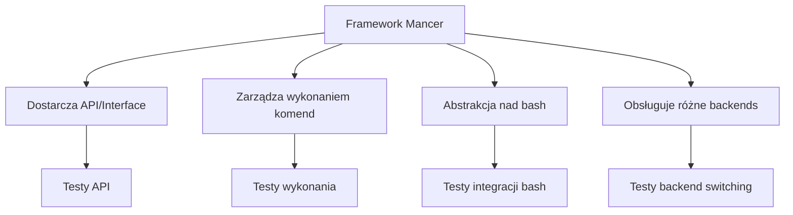

# 🧪 **Teoria Testowania Frameworka Mancer**

## 📋 **Spis treści**
1. [Wprowadzenie do testowania frameworków](#wprowadzenie)
2. [Specyfika testowania bash wrapper](#bash-wrapper)
3. [Piramida testów dla Mancer](#piramida)
4. [Strategie testowania w Docker](#docker-testing)
5. [Testy automatyczne vs manualne](#automatyzacja)
6. [Architektura systemu testów](#architektura)
7. [Best practices](#best-practices)
8. [Plan implementacji](#plan)

---

## 🎯 **1. Wprowadzenie do testowania frameworków** {#wprowadzenie}

### **Dlaczego testowanie frameworka jest inne niż aplikacji?**



### **Co framework Mancer MUSI testować:**

1. **🔧 Funkcjonalność podstawowa**
   - Czy CommandFactory tworzy komendy poprawnie?
   - Czy BashBackend wykonuje bash commands?
   - Czy ShellRunner orchestruje wszystko razem?

2. **🔗 Integracja komponentów**
   - Czy ShellRunner + CommandFactory + BashBackend działają razem?
   - Czy context management działa?
   - Czy error handling jest konsystentny?

3. **⚡ Wydajność i stabilność**
   - Czy cache działa poprawnie?
   - Czy nie ma memory leaks?
   - Czy obsługuje concurrent execution?

4. **🌐 Kompatybilność środowisk**
   - Czy działa w różnych systemach?
   - Czy SSH backend działa tak samo jak bash?
   - Czy konteneryzacja nie psuje funkcjonalności?

---

## 🛠️ **2. Specyfika testowania bash wrapper** {#bash-wrapper}

### **Framework Mancer = Bash Wrapper + Abstrakcja**

```python
# To co testujemy:
runner = ShellRunner(backend_type="bash")
echo_cmd = runner.create_command("echo").text("test")
result = runner.execute(echo_cmd)

# Sprawdzamy:
assert result.success == True           # ← Framework działanie
assert "test" in result.raw_output     # ← Bash execution
assert result.exit_code == 0           # ← Command result
```

### **3 warstwy testowania bash wrapper:**

#### **Warstwa 1: Unit Tests (Izolowane komponenty)**
```python
class TestCommandFactory:
    def test_create_echo_command(self):
        factory = CommandFactory("bash")
        cmd = factory.create_command("echo")
        assert cmd is not None
        assert hasattr(cmd, 'text')
        assert hasattr(cmd, 'build_command')
```

#### **Warstwa 2: Integration Tests (Komponenty + bash)**
```python
class TestFrameworkIntegration:
    def test_echo_command_execution(self):
        runner = ShellRunner(backend_type="bash")
        echo_cmd = runner.create_command("echo").text("framework test")
        result = runner.execute(echo_cmd)
        
        assert result.success == True
        assert "framework test" in result.raw_output
```

#### **Warstwa 3: E2E Tests (Framework + Docker + Environment)**
```python
class TestDockerIntegration:
    def test_framework_in_container(self):
        # Test frameworka w izolowanym środowisku Docker
        container_result = execute_in_container(
            "python3 -c 'from mancer import ShellRunner; print(\"OK\")'"
        )
        assert "OK" in container_result.stdout
```

---

## 🏗️ **3. Piramida testów dla Mancer** {#piramida}

```
                    🔺 E2E Tests (Docker Integration)
                   /     - Framework w kontenerach
                  /      - SSH connectivity  
                 /       - Network communication
                /        - Performance metrics
               /         
              /        🔺 Integration Tests
             /         - ShellRunner + BashBackend
            /          - CommandFactory + Commands
           /           - Cache functionality
          /            - Context management
         /
        /           🔺🔺🔺 Unit Tests 
       /            - CommandFactory
      /             - BashBackend  
     /              - Individual Commands
    /               - Command building
   /                - Error handling
  /
 /________________🔺🔺🔺🔺 Static Analysis
                  - Code linting
                  - Type checking
                  - Security scans
```

### **Proporcje testów (Test Pyramid):**
- **70%** Unit Tests - szybkie, izolowane, mockowane
- **20%** Integration Tests - komponenty razem, prawdziwy bash
- **10%** E2E Tests - framework w Docker, pełna integracja

### **Dlaczego ta proporcja?**

**Unit Tests (70%)** - Bo framework ma dużo logiki:
- Command building logic
- Parameter validation
- Error handling
- Cache management
- Context switching

**Integration Tests (20%)** - Bo bash integration jest kluczowy:
- Prawdziwe wykonanie bash commands
- Output parsing
- Error code handling
- Environment variables

**E2E Tests (10%)** - Bo Docker/SSH to dodatkowa złożoność:
- Najwolniejsze
- Najbardziej flaky
- Ale sprawdzają rzeczywiste użycie

---

## 🐳 **4. Strategie testowania w Docker** {#docker-testing}

### **Dlaczego Docker dla testów frameworka?**

1. **🔒 Izolacja środowiska**
   ```bash
   # Framework może mieć side effects
   runner.execute(runner.create_command("rm").file("/tmp/test"))
   # Docker izoluje to od host system
   ```

2. **🌐 Standaryzacja środowiska**
   ```yaml
   # Każdy test ma identyczne środowisko
   containers:
     mancer-test-1: { image: ubuntu:22.04, python: 3.10 }
     mancer-test-2: { image: ubuntu:22.04, python: 3.10 }
   ```

3. **🔗 Test komunikacji SSH**
   ```python
   # Framework musi działać przez SSH
   runner.set_remote_execution(host="mancer-test-2", user="mancer2")
   result = runner.execute(runner.create_command("hostname"))
   assert "mancer-test-2" in result.raw_output
   ```

### **Strategia Docker testów:**

#### **A) Statyczne kontenery (mancer-test-1, 2, 3)**
```python
@pytest.fixture(scope="session")
def docker_containers():
    # Kontenery startują raz na sesję testów
    # Szybsze dla wielu testów
    return ["mancer-test-1", "mancer-test-2", "mancer-test-3"]
```

#### **B) Dynamiczne kontenery (per test)**
```python
@pytest.fixture(scope="function")  
def clean_container():
    # Nowy kontener na każdy test
    # Wolniejsze, ale izolowane
    container = docker.create_container("ubuntu:22.04")
    yield container
    docker.remove_container(container)
```

#### **C) Hybrid approach (Nasz wybór)**
```python
# Statyczne kontenery dla integration tests
# Dynamiczne dla E2E które potrzebują clean state
```

---

## 🤖 **5. Testy automatyczne vs manualne** {#automatyzacja}

### **Co MUSI być automatyczne:**

#### **✅ Regression Tests**
```python
def test_ls_command_backward_compatibility():
    # Każda zmiana w kodzie musi przejść ten test
    runner = ShellRunner(backend_type="bash")
    ls_cmd = runner.create_command("ls")
    result = runner.execute(ls_cmd)
    
    assert result.success == True  # ← Nie może się zepsuć
    assert hasattr(result, 'raw_output')
    assert hasattr(result, 'exit_code')
```

#### **✅ CI/CD Pipeline Tests**
```yaml
# .github/workflows/test.yml
name: Framework Tests
on: [push, pull_request]
jobs:
  test:
    runs-on: ubuntu-latest
    steps:
      - name: Unit Tests
        run: pytest tests/unit/ -v
      - name: Integration Tests  
        run: docker-compose up -d && pytest tests/integration/
      - name: Performance Tests
        run: python3 tests/performance/benchmark.py
```

#### **✅ Smoke Tests (Szybka weryfikacja)**
```python
def test_framework_smoke():
    """Czy framework w ogóle startuje?"""
    runner = ShellRunner(backend_type="bash")
    assert runner is not None
    assert runner.factory is not None
    
    # Czy podstawowa komenda działa?
    echo_cmd = runner.create_command("echo").text("smoke test")
    result = runner.execute(echo_cmd)
    assert result.success == True
```

### **Co może być manualne:**

#### **🔍 Exploratory Testing**
- Testowanie edge cases których nie przewidzieliśmy
- Performance testing w różnych środowiskach
- Usability testing API frameworka

#### **🐛 Bug Reproduction**
```python
def test_bug_issue_123():
    """Manual test case for bug found in production"""
    # Reprodukuje konkretny bug zgłoszony przez użytkownika
    runner = ShellRunner(backend_type="bash")
    # ... specific case that was failing
```

---

## 🏛️ **6. Architektura systemu testów** {#architektura}

### **Struktura katalogów:**

```
tests/
├── unit/                    # 70% testów - szybkie, mockowane
│   ├── test_commands.py     # CommandFactory + poszczególne komendy
│   ├── test_chain.py        # ShellRunner + command chains
│   ├── test_backend.py      # BashBackend + SSH backend
│   └── test_cache.py        # Cache functionality
│
├── integration/             # 20% testów - komponenty + bash
│   ├── test_bash_commands.py    # Framework + prawdziwy bash
│   ├── test_ssh_integration.py  # Framework + SSH
│   └── test_utils.py            # Utilities dla testów
│
├── e2e/                     # 10% testów - framework + Docker
│   ├── test_docker_integration.py  # Framework w kontenerach
│   ├── test_performance.py         # Performance w Docker
│   └── test_network.py             # SSH między kontenerami
│
├── fixtures/                # Test data
│   ├── mock_responses/      # Mock outputs dla bash commands
│   └── test_configs/        # Test configurations
│
└── conftest.py             # Pytest configuration
```

### **Test Utilities Architecture:**

```python
# tests/utils/framework_test_utils.py
class MancerTestUtils:
    """Centralized utilities dla wszystkich testów"""
    
    @staticmethod
    def create_mock_runner() -> ShellRunner:
        """Tworzy ShellRunner z mockowanym backend"""
        
    @staticmethod  
    def execute_in_docker(container: str, command: str):
        """Wykonuje komendę w kontenerze Docker"""
        
    @staticmethod
    def validate_command_result(result: CommandResult):
        """Standardowa walidacja wyniku komendy"""
        
    @staticmethod
    def wait_for_container_ready(container: str, timeout: int):
        """Czeka aż kontener będzie gotowy do testów"""
```

---

## 🎯 **7. Best practices** {#best-practices}

### **A) Test Naming Convention**

```python
# ❌ Źle
def test_command():
    pass

# ✅ Dobrze - opisuje co testuje
def test_echo_command_creates_valid_bash_string():
    pass
    
def test_shell_runner_executes_echo_command_successfully():
    pass

def test_bash_backend_handles_command_timeout_gracefully():
    pass
```

### **B) Test Data Management**

```python
# ❌ Źle - hardcoded values w testach
def test_echo():
    result = runner.execute(runner.create_command("echo").text("some random text"))
    assert "some random text" in result.raw_output

# ✅ Dobrze - parametrized i reusable
@pytest.mark.parametrize("test_text", [
    "simple text",
    "text with spaces", 
    "text'with'quotes",
    "text\"with\"double_quotes",
    "text\nwith\nnewlines"
])
def test_echo_command_handles_various_inputs(test_text):
    result = runner.execute(runner.create_command("echo").text(test_text))
    assert test_text in result.raw_output
```

### **C) Error Testing Strategy**

```python
class TestFrameworkErrorHandling:
    def test_invalid_command_returns_error_result(self):
        """Framework powinien gracefully handle invalid commands"""
        runner = ShellRunner(backend_type="bash")
        invalid_cmd = runner.create_command("nonexistent_command_12345")
        
        if invalid_cmd is None:
            # Expected behavior - factory returns None
            assert True
        else:
            # Jeśli factory coś zwróci, to execution powinno fail gracefully
            result = runner.execute(invalid_cmd)
            assert result.success == False
            assert result.exit_code != 0
    
    def test_timeout_handling(self):
        """Framework powinien handle timeouts"""
        runner = ShellRunner(backend_type="bash", timeout=1)
        # Komenda która trwa długo
        sleep_cmd = runner.create_command("sleep").seconds(10)
        result = runner.execute(sleep_cmd)
        
        assert result.success == False
        assert "timeout" in result.error_output.lower()
```

### **D) Performance Testing**

```python
class TestFrameworkPerformance:
    def test_command_execution_time(self):
        """Framework nie powinien dodawać dużego overhead"""
        runner = ShellRunner(backend_type="bash")
        
        start_time = time.time()
        result = runner.execute(runner.create_command("echo").text("perf test"))
        execution_time = time.time() - start_time
        
        assert result.success == True
        assert execution_time < 0.1  # Framework overhead < 100ms
    
    @pytest.mark.parametrize("cache_enabled", [True, False])
    def test_cache_performance_impact(self, cache_enabled):
        """Cache powinien przyspieszać powtarzalne komendy"""
        runner = ShellRunner(
            backend_type="bash", 
            enable_cache=cache_enabled,
            cache_size=100
        )
        
        cmd = runner.create_command("echo").text("cache test")
        
        # Pierwsze wykonanie
        start = time.time()
        result1 = runner.execute(cmd)
        first_time = time.time() - start
        
        # Drugie wykonanie (z cache jeśli enabled)
        start = time.time()  
        result2 = runner.execute(cmd)
        second_time = time.time() - start
        
        assert result1.success == True
        assert result2.success == True
        
        if cache_enabled:
            # Z cache powinno być szybsze
            assert second_time < first_time
```

---

## 📝 **8. Plan implementacji** {#plan}

### **Faza 1: Foundation (Tydzień 1-2)**

```python
# 1. Podstawowe unit testy
tests/unit/
├── test_command_factory.py     # CommandFactory core logic
├── test_bash_backend.py        # BashBackend execution
└── test_shell_runner.py        # ShellRunner orchestration

# 2. Test utilities
tests/utils/
└── framework_test_utils.py     # Reusable test utilities

# 3. CI/CD integration
.github/workflows/
└── tests.yml                   # Automated testing pipeline
```

### **Faza 2: Integration (Tydzień 3)**

```python
# 1. Integration testy
tests/integration/
├── test_framework_integration.py  # Komponenty razem
└── test_bash_execution.py         # Framework + prawdziwy bash

# 2. Docker test environment
development/docker_test/
├── test_containers.yml            # Test-specific containers
└── integration_test_runner.sh     # Integration test launcher
```

### **Faza 3: E2E & Performance (Tydzień 4)**

```python
# 1. E2E testy w Docker
tests/e2e/
├── test_docker_integration.py     # Framework w kontenerach
├── test_ssh_connectivity.py       # SSH między kontenerami
└── test_performance.py            # Performance metrics

# 2. Monitoring i reporting
tests/reports/
├── coverage_report.py             # Test coverage analysis
└── performance_benchmarks.py      # Performance tracking
```

### **Faza 4: Automation & Monitoring (Tydzień 5)**

```python
# 1. Automated test execution
scripts/
├── run_all_tests.sh               # Master test runner
├── run_quick_tests.sh             # Smoke tests dla dev
└── run_performance_tests.sh       # Performance testing

# 2. Quality gates
.pre-commit-hooks.yaml             # Pre-commit test execution
pytest.ini                        # Pytest configuration
coverage.ini                      # Coverage requirements
```

---

## 🎯 **Podsumowanie strategii testowania**

### **Co framework Mancer MUSI mieć:**

1. **✅ Unit Tests (70%)** - CommandFactory, BashBackend, ShellRunner
2. **✅ Integration Tests (20%)** - Framework + bash execution  
3. **✅ E2E Tests (10%)** - Framework w Docker + SSH
4. **✅ Performance Tests** - Cache, execution time, memory usage
5. **✅ Error Handling Tests** - Graceful failures, timeouts
6. **✅ Automated CI/CD** - Tests na każdy commit
7. **✅ Regression Tests** - Backward compatibility

### **Dlaczego to jest konieczne:**

- **Framework = Foundation** - Błędy w frameworku = broken applications
- **Bash Wrapper = Complex** - Wiele edge cases, environment dependencies  
- **Multiple Backends** - SSH, bash, powershell - wszystko musi działać
- **Performance Critical** - Framework nie może być bottleneck
- **Developer Experience** - Dobry framework = łatwe użycie

**System testów to inwestycja w przyszłość frameworka!** 🚀 