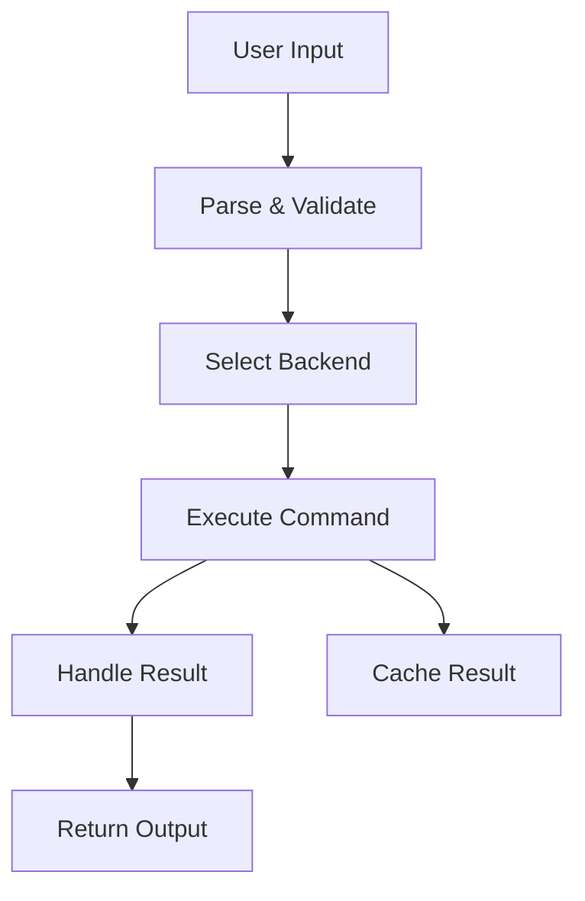

# Command Flow

This page describes how a command is processed in Mancer from user input to execution and result handling.

## Steps
1. **User Input**: The user issues a command via CLI, API, or script.
2. **Command Parsing**: The input is parsed and validated.
3. **Backend Selection**: The appropriate backend (bash, ssh, powershell) is chosen based on context.
4. **Execution**: The command is executed in the selected backend.
5. **Result Handling**: Output, errors, and status are captured and returned.
6. **Caching (optional)**: Results may be cached for future use.

## Diagram

