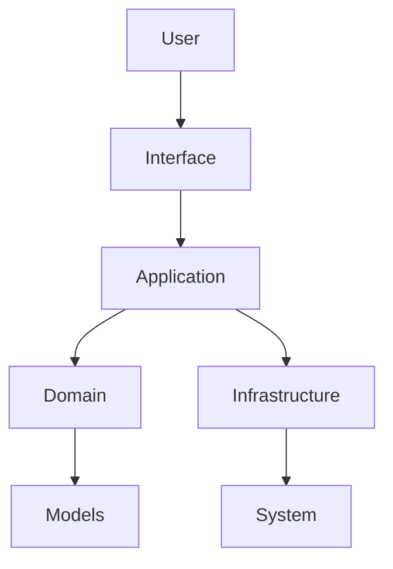

# Architecture Overview

Mancer is designed with a layered, Domain-Driven Design (DDD) approach. The main layers are:

- **Application Layer**: Orchestrates commands, chains, and user interactions.
- **Domain Layer**: Contains business logic, models, and core abstractions.
- **Infrastructure Layer**: Handles system integration, backends, and external services.
- **Interfaces**: CLI, API, and other user-facing components.

## High-Level Diagram

## Detailed Architecture

For a comprehensive understanding of the DDD architecture, see:
- [DDD Architecture Overview](ddd-overview.md) - Complete architecture details with diagrams
- [Modules](modules.md) - Detailed module descriptions
- [Command Flow](command-flow.md) - Command execution flow

## Core Components

### Application Layer
- **ShellRunner**: High-level interface for command execution
- **CommandManager**: Lower-level interface for advanced orchestration
- **CommandChain**: Manages command pipelines and workflows

### Domain Layer
- **Models**: CommandContext, CommandResult, VersionInfo
- **Interfaces**: ICommand, IExecutionBackend, IResultParser
- **Services**: VersionService, FormatService, CacheService

### Infrastructure Layer
- **Commands**: System commands (ls, ps, df, etc.)
- **Backends**: Local (bash), Remote (SSH), PowerShell
- **Configuration**: Tool versions, settings, and environment

## Design Principles

- **Separation of Concerns**: Each layer has specific responsibilities
- **Dependency Inversion**: High-level modules don't depend on low-level modules
- **Single Responsibility**: Each class has one reason to change
- **Open/Closed**: Open for extension, closed for modification

## Extensibility Points

- **Custom Commands**: Extend BaseCommand for new system commands
- **Custom Backends**: Implement IExecutionBackend for new execution environments
- **Custom Formats**: Extend DataFormat enum and conversion logic
- **Plugins**: Future plugin system for advanced extensibility

For details on extending Mancer, see:
- [Custom Commands](extending/custom-commands.md)
- [Adding Backends](extending/backends.md)
- [Plugins](extending/plugins.md)
