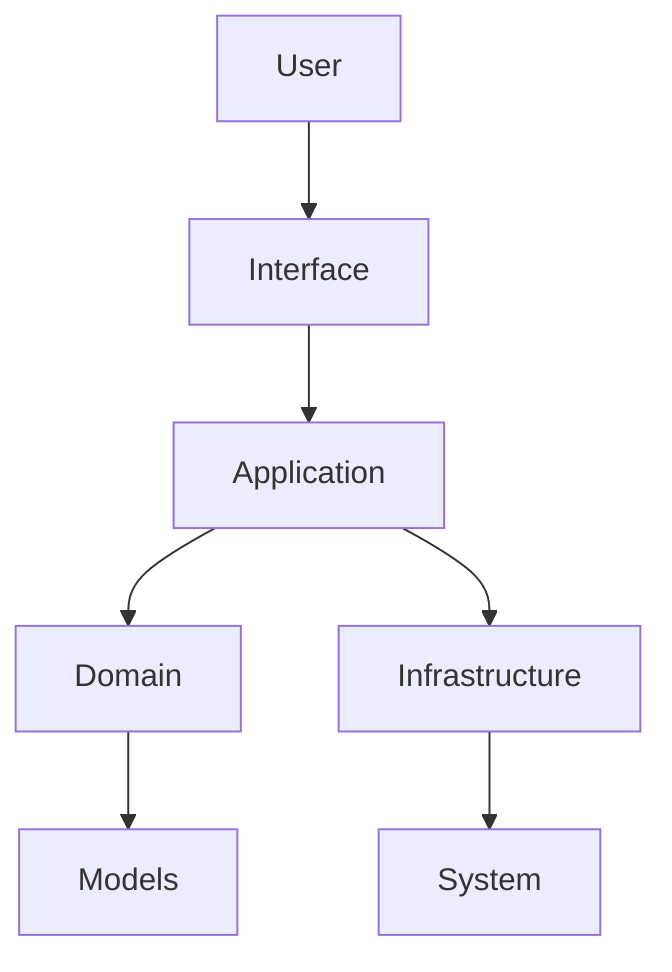

# Architecture Overview

Mancer is designed with a layered, Domain-Driven Design (DDD) approach. The main layers are:

- **Application Layer**: Orchestrates commands, chains, and user interactions.
- **Domain Layer**: Contains business logic, models, and core abstractions.
- **Infrastructure Layer**: Handles system integration, backends, and external services.
- **Interfaces**: CLI, API, and other user-facing components.

## High-Level Diagram

For details, see [Modules](modules.md) and [Command Flow](command-flow.md).
